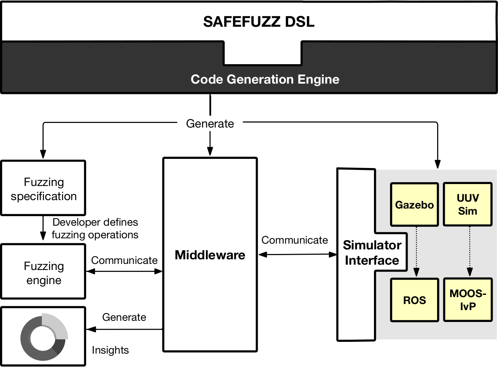

# SAFEFuzz Infrastructure
## Introduction

SAFEFuzz provides a model-based testing approach (incorporating fuzz
testing) that supports the identification of mission safety
requirement violations in robotic systems.

SAFEFuzz employs a domain-specific language for the mission and
fuzzing specification, thus raising the level of abstraction by
abstracting away low-level simulator-specific details and providing
simulator independence.

To this end, SAFEFuzz enables roboticists and test experts to easily
specify the fuzzing space and launch two distinct evolutionary-guided
fuzzing synthesis techniques:

* a time-based variant focused on timing intervals where deviations
  from safety requirements can occur

* a condition-based variant that utilises a grammar to yield the
  events leading to these deviations.

To achieve these, SAFEFuzz leverages the publish-subscribe
protocol underpinning widely-used robotic simulators (e.g., ROS/Gazebo
and MOOS-IvP and is underpinned by an extensible middleware that
supports separation of concerns between fuzzing and the target robotic
simulator.

To the best of our knowledge, SAFEFuzz is the first model-driven,
systematic, and automated testing approach that employs fuzzing to
establish the dependability levels of a robotic system under test
while providing simulation independence and the permitting test
engineers to implement custom scenario-specific fuzzing operations.

## Video Demonstration

A video demonstration of SAFEFuzz, showing the platform and its
operation is presented [here](video-demos/safefuzz-demo.mp4). This
demonstration shows the specification of the mission and the fuzzing
tests to be performed, followed by an example of launching the fuzzing
for a time-based experiment. 

## Repository Structure

The directories contained in the repository are as follows:

* middleware-java: contains the code
* ecore-metamodels: contains the atlas.emf and fuzzspec.emf metamodel definition files
* grammar: the BNF definition of the grammar for the condition-based fuzzing experiments
* expt-results-extra: contains additional discussion of the result files from the paper
* fuzzing-configs: some example fuzzing configuration CSV files used in system testing
* video-demos: an example MP4 video demonstrating the SafeFuzz platform
* results: contains result files produced from the experiments discussed in the paper

## Results
The additional result discussion in the paper experimental evaluation
are presented [here](expt-results-extra/index.html)
